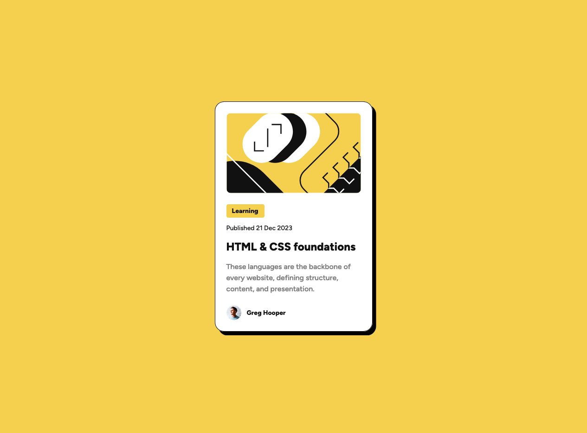

# Frontend Mentor - Blog preview card solution

This is a solution to the [Blog preview card challenge on Frontend Mentor](https://www.frontendmentor.io/challenges/blog-preview-card-ckPaj01IcS). Frontend Mentor challenges help you improve your coding skills by building realistic projects.

## Overview

### The challenge

Users should be able to:

- See hover and focus states for all interactive elements on the page
- See the website in all devices seemlessly

### Screenshot

### Links

- Solution URL: [Source Code](https://github.com/chinmayjha/blog-preview-card)
- Live Site URL: [Demo](https://chinmayjha.github.io/blog-preview-card)

## My process

### Built with

- Semantic HTML5 markup
- CSS custom properties
- Flexbox

## Author

- Website - [Chinmay Jha](https://chinmayjha.github.io/)
- Frontend Mentor - [@chinmayjha](https://www.frontendmentor.io/profile/chinmayjha)
- Twitter - [@itschinmayjha](https://www.twitter.com/itschinmayjha)